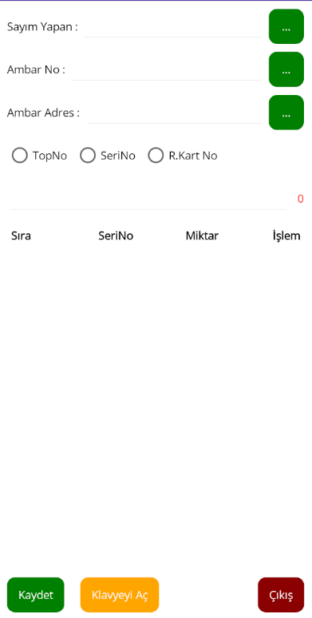
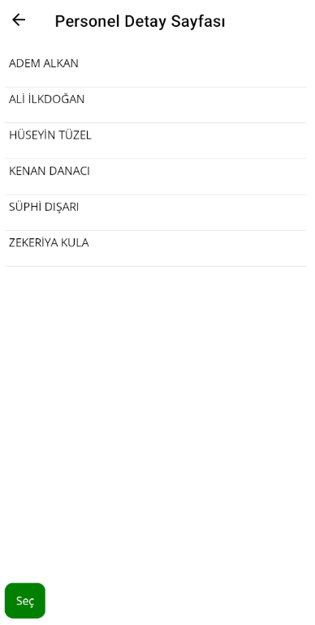
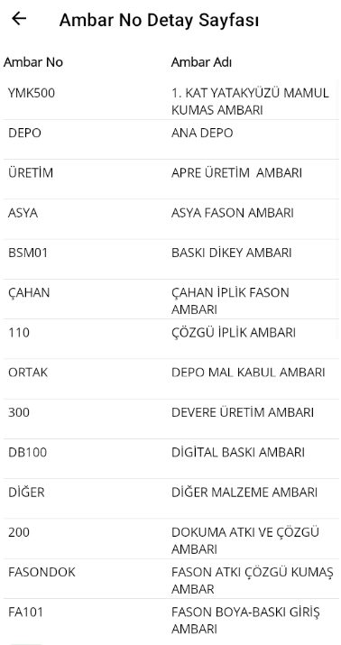

# Sayim.Mobile

In this project, after the user logs in, the home page appears, and all inventory-related operations are as follows:
The "Sayım" and "Ambar Adres" fields are mandatory.

# Login Page
On this page, users log in to the application by entering their Kullanici Kodu and Password.


# Main Menu
After logging in, the main menu appears where selecting the Sayim and Ambar No is mandatory. Pressing buttons on the right should open a new page. The user can enter TopNo, SeriNo, and Refakart Kart No.


# Personel List


# Ambar No List


# Technologies Used
- .NET MAUI
- ASP.NET Core Web API (REST API)
- Microsoft SQL Server
- Entity Framework

# Packages
## .NET MAUI 
```sh
dotnet add package CommunityToolkit.Maui --version 9.0.2
dotnet add package Microsoft.EntityFrameworkCore.Relational --version 9.0.0-preview.6.24327.4
```

## Sayim.ApiClient 
```sh
dotnet add package Microsoft.Extensions.Options --version 9.0.0-preview.6.24327.7
dotnet add package System.Net.Http.Json --version 9.0.0-preview.6.24327.7
```

## Sayim.Api 
```sh
dotnet add package Microsoft.EntityFrameworkCore --version 9.0.0-preview.6.24327.4
dotnet add package Microsoft.EntityFrameworkCore.Design --version 9.0.0-preview.6.24327.4
dotnet add package Microsoft.EntityFrameworkCore.SqlServer --version 9.0.0-preview.6.24327.4
dotnet add package Microsoft.EntityFrameworkCore.Tools --version 9.0.0-preview.6.24327.4
